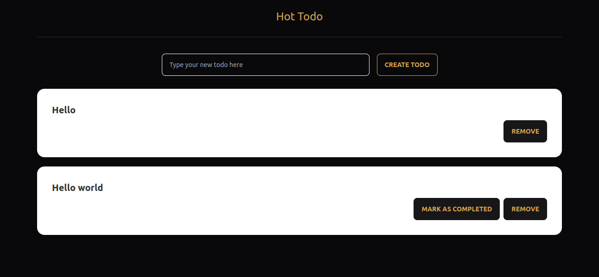

<h3 align="center">Hot Todo!</h3>

<div align="center">

[](https://github.com/rawda-developer/Hot-Todo)
[](https://github.com/rawda-developer/Hot-Todo/issues)
[](https://github.com/rawda-developer/Hot-Todo)

</div>

---

<p align="center"> Hot Todo is a todo list app built using the MERN Stack. The user can add, delete todo items and mark any of them as completed
    <br> 
</p>



## 📝 Table of Contents

- [About](#about)
- [Getting Started](#getting_started)
- [Built Using](#built_using)
- [Authors](#authors)

## 🧐 About <a name = "about"></a>

The purpose of this project is to provide a guide to use the MERN Stack and the redux library in my future projects.

## 🏁 Getting Started <a name = "getting_started"></a>

### Prerequisites

```
node -v
npm -v
```

### Installing

1. Clone the repository

```
git clone https://github.com/rawdaymohamed/Hot-Todo
cd Hot-Todo
```

2. For the frontend

```
cd frontend
npm install
npm start
```

3. For the backend

```
cd ..
cd backend
npm install
npm start
```

## ⛏️ Built Using <a name = "built_using"></a>

- [MongoDB](https://www.mongodb.com/) - Database
- [Express](https://expressjs.com/) - Server Framework
- [ReactJS](https://create-react-app.dev/) - Web Framework
- [NodeJs](https://nodejs.org/en/) - Server Environment

## ✍️ Authors <a name = "authors"></a>

- [@RawdaDeveloper](https://github.com/rawdaymohamed/) - Idea & Initial work
